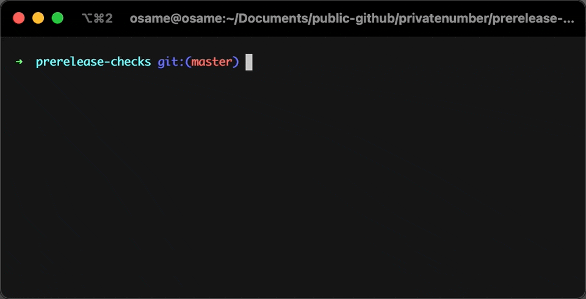

# before-you-publish <a href="https://npm.im/before-you-publish"></a> <a href="https://npm.im/before-you-publish"></a> <a href="https://packagephobia.now.sh/result?p=before-you-publish"></a> <a href="https://bundlephobia.com/result?p=before-you-publish"></a>

Run essential pre-release checks before releasing an npm package.

💞 Works well with [standard-version](https://github.com/conventional-changelog/standard-version)!

<p align="center">
  
</p>

<sub>If you like this project, please star it & [follow me](https://github.com/privatenumber) to see what other cool projects I'm working on! ❤️</sub>

## 🙋‍♂️ Why?
Because there are many points of failure when making a release.

This CLI runs a thorough check to guarantee a successful package release:

#### ✅ npm
- [x] Assert npm version
- [x] Validate `package.json`
  - [x] Check valid npm name
  - [x] Check valid semver version
  - [x] Verify public package
- [x] Verify npm registry is reachable (in case custom)
- [x] Verify npm publish registry is reachable
- [x] Verify user is authenticated to publish registry and has permissions

#### ✅ Git
- [x] Assert Git version
- [x] Verify working directory is clean
- [x] Verify current branch is release branch
- [x] Verify remote head exists
- [x] Verify current branch is identical to upstream

## 🚀 Install
```sh
npm i -D before-you-publish
```

### npx
You can also install-and-run as you need it via npx:
```sh
npx before-you-publish
```

## 🚦 Quick Setup


### As a prepublish hook
Add `before-you-publish` as a [`prepublishOnly` hook](https://docs.npmjs.com/cli/v7/using-npm/scripts#life-cycle-scripts) in your `package.json`:
```diff
 {
   "scripts": {
+    "prepublishOnly": "before-you-publish"
   }
 }
```


### With standard-version
If you're using [standard-version](https://github.com/conventional-changelog/standard-version), add it to their `prerelease` hook.

```diff
 {
   "scripts": {
+    "prerelease": "before-you-publish",
     "release": "standard-version"
   }
 }
```

### Other
You can prepend your release script with `before-you-publish`.

```diff
 {
   "scripts": {
+    "release": "before-you-publish && my-custom-release-command",
   }
 }
```


## 🙏 Credits
Many inspirations taken from the prerequisite checks from [np](https://github.com/sindresorhus/np/).
